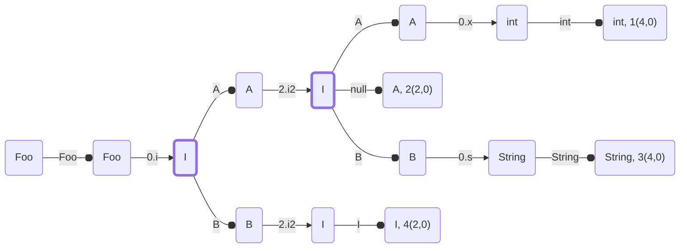

# switch pattern generation
A prototype showing how to generate code for a switch on patterns

We suppose that a list of patterns is valid and type-checked, and the goal is to generate
a code compact, effective and raising descriptive exceptions/errors.

Java requires switch to be exhaustive, either because there is a bottom type or because there is a sealed type
and all subtypes are covered.

In order to avoid to have to specify what to do in case of null or if a type not present at compile time
is present at runtime, Java has a notion of remainders which are the types that the users do not have
to specify in terms of typechecking and that are handled automatically by the runtime.

### Naive Translation

Let suppose we have the following types, a record Foo, a sealed interface I and two records A and B
implementing the interface I.

```java
record Foo(I i, I i2) {}
sealed interface I {}
record A(int x) implements I {}
record B(String s) implements I {}
```

And a switch that mixes matching on I as a sealed interface and matching I as a bottom type.

```java
Foo r0 = ...
switch(r0) {
  case Foo(A a, A(int x)) -> 1
  case Foo(A a, A a) -> 2
  case Foo(A a, B(String s)) -> 3
  case Foo(B b, I i) -> 4
}
```

A naive translation is to generate each pattern as a cascade of `instanceof`
(the pattern are numbered 1 to 4 in the code below).

```java
A r1 = r0.i();
if (r1 instanceof A) {  // pattern 1
  A r2 = (A) r1;
  I r3 = r0.i2();
  if (r3 instanceof A) {
    A r4 = (A) r3;
    if (r4 != null) {
      int r5 = r4.x();
      return call 1(r2, r5);
    }
  }
}
if (r1 instanceof A) {  // pattern 2
  A r2 = (A) r1;
  I r3 = r0.i2();
  if (r3 instanceof A) {
    A r4 = (A) r3;
    return call 2(r2, r4);
  }
}
if (r1 instanceof A) {  // pattern 3
  A r2 = (A) r1;
  I r3 = r0.i2();
  if (r3 instanceof B) {
    B r4 = (B) r3;
    if (r4 != null) {
      String r5 = r4.s();
      return call 3(r2, r5);
    }
  }
}
if (r1 instanceof B) {  // pattern 4
  B r2 = (B) r1;
  I r3 = r0.i2();
  return call 4(r2, r3);
}
throw new MatchException();
```

That translation as several issues, the most important is that is it does not provide precise error messages,
by example `new Foo(null, ...)` and `new Foo(new C(), ...)` both throws a `MatchException` and the user is let alone
to figure the exact issue. The other issue is performance, for `new Foo(new A(), new B())`, the expression
`r1 instanceof A` is evaluated 3 times before recognizing the pattern 3.

We are proposing to improve the code generation by first using a Decision Tree, a technique pioneered in the '90
to share the computation of patterns starting with the same prefix and altering the generated code to
either produces a `NullPointerException` or a `IncompatibleClassChangeError` to help users
debugging this kind of code.

And obviously we can still have the usual Java error, like `ClassCastException` in case of unsafe casts
(the switch itself does not allow unsafe cast, but an unsafe cast can be done before entering the switch).

Here is the decision tree for the example above.

A node correspond to a variable with a type. The first node, is the variable r0 with the type of
the expression switched upon.
There are 3 kind of nodes, nodes that process the value of the variable and the nodes that "calls"
an index with the values of the bindings
- a start node initialized with the value switched upon
- an end node (a node with a dashed border), that contains an index of the case and a list of bindings
  (each integer refers to the value of the preceding nodes).
- a intermediary node (a node with a solid border) has two kind of transitions,
  - a transition that verifies a type represented by a link with a circle
  - a transition that computes an accessor represented by a link with an arrow.
    (the receiver of the accessor is encoded as an integer indicating a preceding node containing the value).

By example, ...



Once the decision tree is built, we can generate a better codes by taking decisions local to a node about
how to generate the most efficient code depending on the transitions of a node.

With our solution, the generated code can be reduced to the code below
which is smaller in terms of generated bytecodes, faster to execute and provides precise error messages.

```java
I r1 = r0.i();
if r1 instanceof A {
  A r2 = (A) r1;
  I r3 = r0.i2();
  if r3 instanceof A {
    A r4 = (A) r3;
    int r5 = r4.x();
    return call 1(r2, r5);
  }
  if r3 == null {
    A r4 = (A) r3;
    return call 2(r2, r4);
  }
  // implicit null check of r3
  B r4 = (B) r3;    // catch(CCE) -> ICCE
  String r5 = r4.s();
  return call 3(r2, r5);
}
// implicit null check of r1
B r2 = (B) r1;    // catch(CCE) -> ICCE
I r3 = r0.i2();
return call 4(r2, r3);
```


### Patterns

```
Pattern = ParenthesizedPattern(pattern: Pattern)
        | TypePattern(type: Class, identifier: String)
        | RecordPattern(type: Class, patterns: List[Pattern], identifier: String)
        ;
```

### Decision Tree

We are proposing to modeling the list of patterns as a decision tree. This is not a new approach,
this is the usual strategy for langage like Caml to generate pattern matching.
The advantage of a decision tree is that if two patterns have a common prefix, the code for the common
prefix is generated only once.

There are more advanced representations based on DAG/compressed data structures (to share pattern suffix)
but given that Java as a limited support for doing an OR between patterns (you can only combine a pattern
with the null pattern), we prefer keep things simple here.

### Code Generation

In order to reduce the amount of generated bytecodes, we are using different tricks
all based on the same idea, we are generating the bytecode so all the possible paths avoid
both explicit checks and supplementary branch if possible.

## How to construct the Decision Tree
// TODO


Algorithm in pseudo-code

```python
class Node(targetClass: Class, component: RecordComponent, componentSource: Node)
  map: Dict[Class, Node]
  componentNode: Node
  index: int or not initialized
  bindingNodes: List[Node]
  isRecord: boolean

def insert(node: Node, pattern: Pattern, bindingNodes: List<Node>) -> Node:
  match pattern:
    case ParenthesizedPattern(p):
      return insert(node, p, bindingNodes)
    case TypePattern(type, identifier):
      n = node.map[type];
      if (n != Null and n.isRecord)
        result = node.map[Null] = Node(type, Null, Null)  
      else
        result = node.map[type] = Node(type, Null, Null)
      bindingNodes.add(result) if identifier != "_"
      return result; 
    case RecordPattern(type, patterns, identifier):
      first = node.map[type] = Node(type, Null, Null)
      first.isRecord = True
      result = first
      var components = type.recordComponents
      for index = 0 .. components.length:
        component = components[i]
        componentPattern = patterns[i];
        if (result.componentNode == Null)
          child = Node(component.type, component, first)
          result.componentNode = child;
        else
          child = result.componentNode;
        result = insert(child, componentPattern, bindingNode)
      bindingNodes.add(first) if identifier != "_"
      return result  

```


```python
class Case(pattern: Pattern, index: int)

def Node createTree(targetType: Class, items: List<Case>) -> Node:
  var root = Node(targetType, null, null);
  for each item in items:
    bindingNodes = List[Node]()
    insert(root, case.pattern, bindingNodes).setIndex(item.index, bindingNodes) 
  return root;
}
```

## How to generate the code from the Decision Tree

```python
def toCode(node: Node, varnum: int, scope: Dict<Node, int>):
  # node with an index
  if node.index is initialized:
    bindings = [scope[n] for n in node.bindingNodes]
    append("return call %d(%s);" % index, bindings))
    return
  
  # value = call the component accessor on the value of a preceding node 
  if node.componentSource != Null:
    input = scope[node.componentSource]
    append("%s %s = %s.%s();" % node.component.type, varnum + 1, input, node.component.name)
    varnum = varnum + 1
    
  for (type, nextNode) in node.map:
    if nextNode is last node:
      if type == node.targetClass or type == Null:
        # do nothing
        scope[node] = varnum
        toCode(nextNode, varnum, scope);
        continue
      if node.total:   # sealed and total
        if type.isRecord and type.recordComponents.length != 0:
          append("// implicit null check of %s" % varnum)
        else  
          append("requireNoNull(%s)" % varnum);
        append("%s %s = (%s) %s;    // catch(CCE) -> ICCE" % type, varnum + 1, type, varnum)
        scope[node] = varnum + 1
        toCode(nextNode, varnum + 1, scope);
        continue;
    
    # not the last transition
    if type == Null:
      append("""
        if %s == null {
          %s %s = (%s) %s;
        """ % varnum, nextNode.targetClass, varnum + 1, nextNode.targetClass, varnum)
      scope[node] = varnum + 1
      toCode(nextNode, varnum + 1, scope)
      append("}")
      continue
      
    if type == node.targetClass:
      append("if %s != null {" % varnum)
      scope[node] = varnum
      toCode(nextNode, varnum, scope)
      continue
      
    append("""
      if %s instanceof %s {
        %s %s = (%s) %s;
      """ % varnum, type, type, varnum + 1, type, varnum)
    scope[node] = varnum + 1
    toCode(nextNode, varnum + 1, scope)  
    append("}")     
  
  if componentNode != Null:
    scope[node] = varnum
    toCode(componentNode, varnum, scope)
```

### Issues

Heap pollution vs Separate compilation
// TODO

Line numbers and debugging information
// TODO

### Examples


