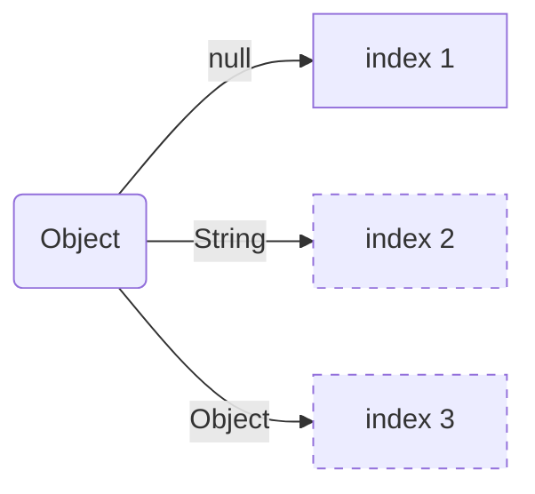
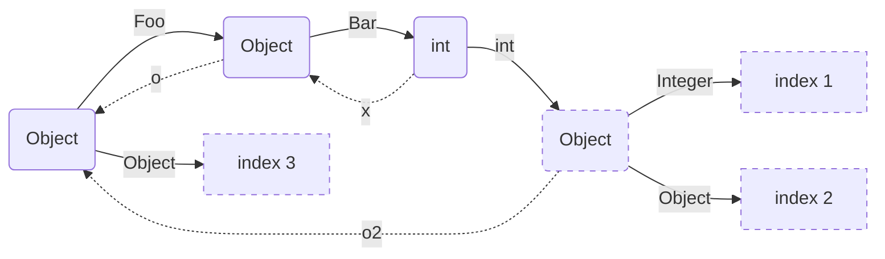
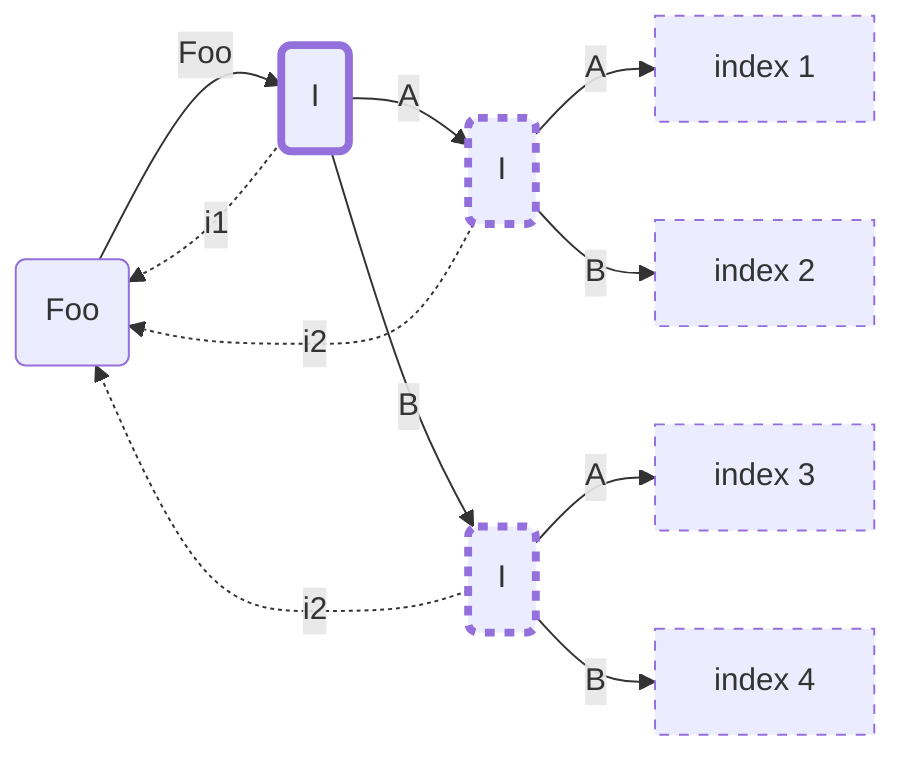
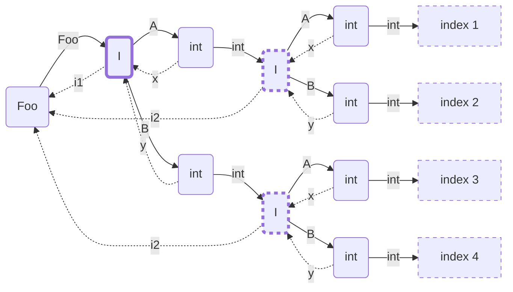

# switch pattern generation
A prototype showing how to generate code for a switch on patterns

We suppose that a list of patterns is valid and type-checked, and the goal is to generate
a code compact, effective and raising descriptive exceptions/errors.

Java patterns are exhaustive either because there is a bottom type or because there is a sealed type
and all subtypes are covered.

There are two kinds of errors, either a value is value but the corresponding does not allow null or
one of the class/record of a sealed hierarchy has changed between the compilation of the patterns
and the execution at runtime.

We are proposing to throw a `NullPointerException` in the former case and `IncompatibleClassChangeError`
in the later case.  And obviously we can still have the usual Java error,
like `ClassCastException` in case of unsafe casts (the switch itself does not allow unsafe cast, but an
unsafe cast can be done before entering the switch). 

### Patterns

```
Pattern = NullPattern()
        | TypePattern(type: Class, identifier: String)
        | ParenthesizedPattern(pattern: Pattern)
        | RecordPattern(type: Class, patterns: List<Pattern>, identifier: Optional<String>)
        ;
```

### Decision Tree

We are proposing to modeling the list of patterns as a decision tree. This is not a new approach,
this is the usual strategy for langage like Caml to generate pattern matching.
The advantage of a decision tree is that if two patterns have a common prefix, the code for the common
prefix is generated only once.

There are more advanced representations based on DAG/compressed data structures (to share pattern suffix)
but given that Java as a limited support for doing an OR between patterns (you can only combine a pattern
with the null pattern), we prefer keep things simple here.

### Code Generation

In order to reduce the amount of generated bytecodes, we are using different tricks
all based on the same idea, we are generating the bytecode so all the possible paths avoid
both explicit checks and supplementary branch if possible.

## How to construct the Decision Tree

Algorithm in pseudo-code

```python
class Node(targetClass: Class, componentPair: Tuple(RecordComponent, Node), binding: boolean)
  dict: Dict<Class, Node>
  index: int or not initialized

def insert(node: Node, pattern: Pattern, targetType: Class, componentPair: Tuple(RecordComponent, Node)) -> Node:
  return switch(pattern):
    case NullPattern(): return node.dict[null] = Node(targetType, componentPair, false)
    case ParenthesizedPattern(p): return insert(p, targetType, componentPair)
    case TypePattern(type, _): return node.dict[type] = Node(targetType, componentPair, true)
    case RecordPattern(type, patterns, identifier):
      var components = type.recordComponents
      
      # first node
      if components is empty:
        return node.dict[type] = Node(targetType, componentPair, identifier.isPresent)
      var n = node.dict[type] = Node(components[0].type, (components[0], node), identifier.isPresent)
      
      # one node per record components
      for index = 0 .. components.length - 1:
        n = n.dict[p.type] = insert(patterns[index], components[index + 1].type, (components[index + 1], node))
        
      # last node
      return n.dict[p.type] = insert(patterns[last], targetType, componentPair)

```


```python
class Case(pattern: Pattern, index: int)

def Node createTree(targetType: Class, cases: List<Case>) -> Node:
  var root = Node(targetType, (null, null), false);
  for each case in cases:
    insert(root, case.pattern, null, null, null).index = case.index
  
  return root;
}      
```

## How to generate the code from the Decision Tree

```python
def toCode(node: Node, varnum: int, scope: Dict<Node, int>, bindings: List<String>):
  if node.binding:
    bindings = bindings.append(r(varnum));

  # node with an index
  if node.index is initialized:
    append("return call %d(%s);" % index, bindings.join(", "))
    return

  # extract record component value from the back reference 
  if component != null:
    var input = scope[node.componentPair.node]
    append("%s %s = %s.%s();" % component.type, r(varnum + 1), r(input), component.name)
    varnum++;

  for each transition(type, nextNode) in dict:
    # type is null, do a nullcheck
    if type == null:
      append("if %s == null {" % r(varnum))
      toCode(nextNode, varnum, scope, bindings)
      append("}\n")
      continue

    # the code is different for the last transition
    if last transition:
      if type == node.targetClass:
        # types are the same, no instanceof needed
        scope[this] = varnum
        toCode(nextNode, varnum, scope, bindings)
        continue
        
      if node.targetClass.isSealed:
        # type is sealed, if null is not handled, generate either an implicit or an explicit NPE
        if node.dict does not contains null:  // null is in the remainder
          if type.isRecord and type.recordComponents.length != 0:
            append("// implicit null check of %s" % r(varnum))
          else:
            append("requireNonNull(%s);" % r(varnum))
        
        # generate a cast that fails if there is more subtypes than at compile time  
        append("%s %s = (%s) %s;    // catch(CCE) -> ICCE" % typename, r(varnum + 1), typename, r(varnum))
        scope[this] = varnum + 1
        toCode(nextNode, varnum + 1, scope, bindings)
        continue
        
    
    # otherwise generate an instanceof  
    append("if %s instanceof %s {
            %s %s = (%s) %s;" % r(varnum), typename, typename, r(varnum + 1), typename, r(varnum))
    scope[this] = varnum + 1
    toCode(nextNode, varnum + 1, scope, bindings)
    append("}\n")
```

### Issues

Heap pollution vs Separate compilation
// TODO

Line numbers and debugging information
// TODO

### Examples

## case 1

```java
Object o = ...
switch(o) {
  case null -> 1
  case String s -> 2
  case Object o2 -> 3
}
```



```java
if r0 == null {
  call 1();
  return;
}
if r0 instanceof String {
  String r1 = (String) r0;
  call 2(r1);
  return;
}
call 3(r0);
return;
```

## case 2

```java
record Foo(Object o, Object o2) {}
record Bar(int x) {}

Object o = ...
switch(o) {
  case Foo(Bar(int x), Integer i) -> 1
  case Foo(Bar(int y), Object o2) -> 2
  case Object o3 -> 3
}
```



```java
if r0 instanceof Foo {
  Foo r1 = (Foo) r0;
  Object r2 = r1.o();
  if r2 instanceof Bar {
    Bar r3 = (Bar) r2;
    int r4 = r3.x();
    Object r5 = r1.o2();
    if r5 instanceof Integer {
      Integer r6 = (Integer) r5;
      call 1(r4, r6);
      return;
    }
    call 2(r4, r5);
    return;
  }
}
call 3(r0);
return;
```

## case 3

```java
sealed interface I {
  final class A implements I {}
  final class B implements I {}
}
record Foo(I i1, I i2) {}

Foo foo = ...
switch(foo) {
  case Foo(A a, A a2) -> 1
  case Foo(A a, B b) -> 2
  case Foo(B b, A a) -> 3
  case Foo(B b, B b2) -> 4
}
```



```java
I r1 = r0.i1();
if r1 instanceof A {
  A r2 = (A) r1;
  I r3 = r0.i2();
  if r3 instanceof A {
    A r4 = (A) r3;
    call 1(r2, r4);
    return;
  }
  requireNonNull(r3);  // null is a remainder
  B r4 = (B) r3;    // catch(CCE) -> ICCE
  call 2(r2, r4);
  return;
}
requireNonNull(r1);  // null is a remainder
B r2 = (B) r1;    // catch(CCE) -> ICCE
I r3 = r0.i2();
if r3 instanceof A {
  A r4 = (A) r3;
  call 3(r2, r4);
  return;
}
requireNonNull(r3);  // null is a remainder
B r4 = (B) r3;    // catch(CCE) -> ICCE
call 4(r2, r4);
return;
```


## Case 4

```java
sealed interface I {
  record A(int x) implements I {}
  record B(int y) implements I {}
}
record Foo(I i1, I i2) {}

Foo foo = ...
switch(foo) {
  case Foo(A(int x), A(int x2))) -> 1
  case Foo(A(int x), B(int y)) -> 2
  case Foo(B(int y), A(int x)) -> 3
  case Foo(B(int y), B(int y2)) -> 4
}
```



```java
I r1 = r0.i1();
if r1 instanceof A {
  A r2 = (A) r1;
  int r3 = r2.x();
  I r4 = r0.i2();
  if r4 instanceof A {
    A r5 = (A) r4;
    int r6 = r5.x();
    call 1(r3, r6);
    return;
  }
  // implicit null check of r4
  B r5 = (B) r4;    // catch(CCE) -> ICCE
  int r6 = r5.y();
  call 2(r3, r6);
  return;
}
// implicit null check of r1
B r2 = (B) r1;    // catch(CCE) -> ICCE
int r3 = r2.y();
I r4 = r0.i2();
if r4 instanceof A {
  A r5 = (A) r4;
  int r6 = r5.x();
  call 3(r3, r6);
  return;
}
// implicit null check of r4
B r5 = (B) r4;    // catch(CCE) -> ICCE
int r6 = r5.y();
call 4(r3, r6);
return;
```


