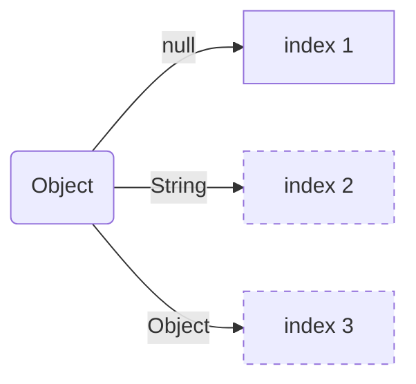
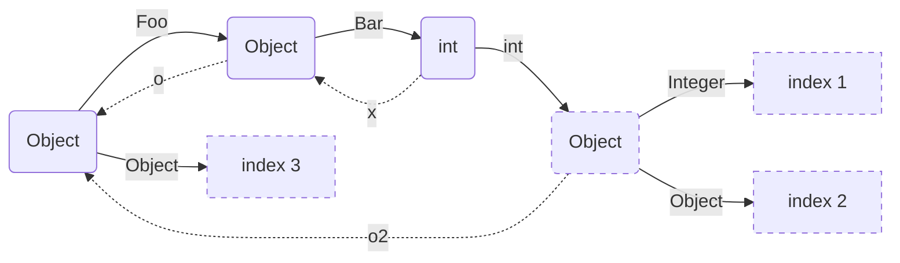
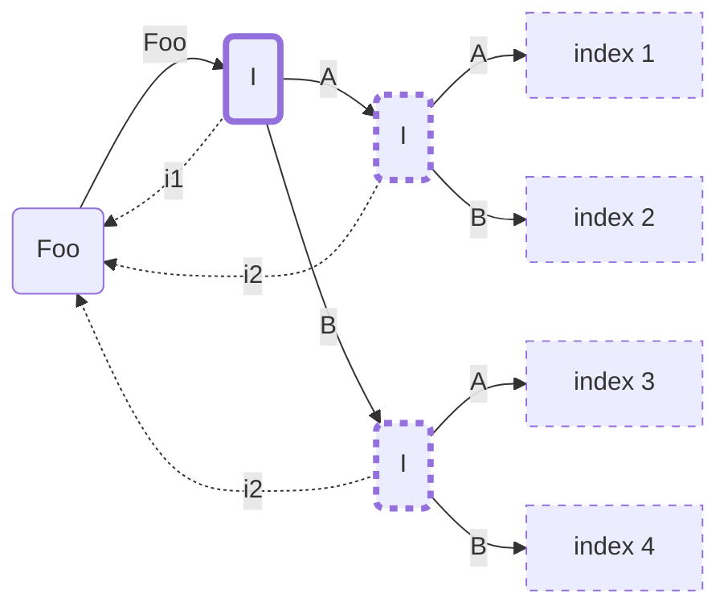
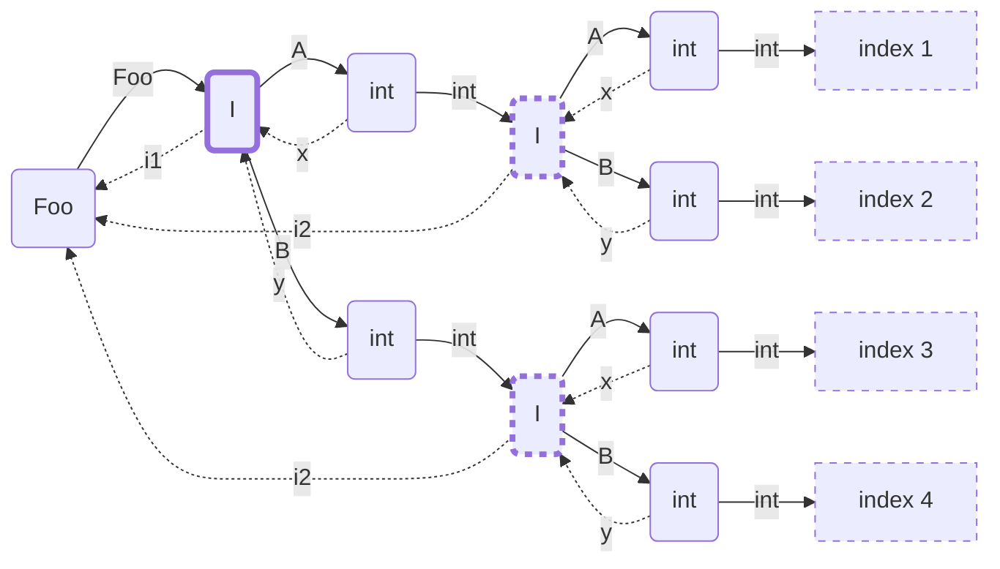

# switch pattern generation
A prototype showing how to generate code for a switch on patterns

## case 1

```java
Object o = ...
switch(o) {
  case null -> 1
  case String s -> 2
  case Object o2 -> 3
}
```



```java
if r0 == null {
  call 1();
  return;
}
if r0 instanceof String {
  String r1 = (String) r0;
  call 2(r1);
  return;
}
call 3(r0);
return;
```

## case 2

```java
record Foo(Object o, Object o2) {}
record Bar(int x) {}

Object o = ...
switch(o) {
  case Foo(Bar(int x), Integer i) -> 1
  case Foo(Bar(int y), Object o2) -> 2
  case Object o3 -> 3
}
```



```java
if r0 instanceof Foo {
  Foo r1 = (Foo) r0;
  Object r2 = r1.o();
  if r2 instanceof Bar {
    Bar r3 = (Bar) r2;
    int r4 = r3.x();
    Object r5 = r1.o2();
    if r5 instanceof Integer {
      Integer r6 = (Integer) r5;
      call 1(r4, r6);
      return;
    }
    call 2(r4, r5);
    return;
  }
}
call 3(r0);
return;
```

## case 3

```java
sealed interface I {
  final class A implements I {}
  final class B implements I {}
}
record Foo(I i1, I i2) {}

Foo foo = ...
switch(foo) {
  case Foo(A a, A a2) -> 1
  case Foo(A a, B b) -> 2
  case Foo(B b, A a) -> 3
  case Foo(B b, B b2) -> 4
}
```



```java
I r1 = r0.i1();
if r1 instanceof A {
  A r2 = (A) r1;
  I r3 = r0.i2();
  if r3 instanceof A {
    A r4 = (A) r3;
    call 1(r2, r4);
    return;
  }
  requireNonNull(r3);  // null is a remainder
  B r4 = (B) r3;    // catch(CCE) -> ICCE
  call 2(r2, r4);
  return;
}
requireNonNull(r1);  // null is a remainder
B r2 = (B) r1;    // catch(CCE) -> ICCE
I r3 = r0.i2();
if r3 instanceof A {
  A r4 = (A) r3;
  call 3(r2, r4);
  return;
}
requireNonNull(r3);  // null is a remainder
B r4 = (B) r3;    // catch(CCE) -> ICCE
call 4(r2, r4);
return;
```


## Case 4

```java
sealed interface I {
  record A(int x) implements I {}
  record B(int y) implements I {}
}
record Foo(I i1, I i2) {}

Foo foo = ...
switch(foo) {
  case Foo(A(int x), A(int x2))) -> 1
  case Foo(A(int x), B(int y)) -> 2
  case Foo(B(int y), A(int x)) -> 3
  case Foo(B(int y), B(int y2)) -> 4
}
```



```java
I r1 = r0.i1();
if r1 instanceof A {
  A r2 = (A) r1;
  int r3 = r2.x();
  I r4 = r0.i2();
  if r4 instanceof A {
    A r5 = (A) r4;
    int r6 = r5.x();
    call 1(r3, r6);
    return;
  }
  // implicit null check of r4
  B r5 = (B) r4;    // catch(CCE) -> ICCE
  int r6 = r5.y();
  call 2(r3, r6);
  return;
}
// implicit null check of r1
B r2 = (B) r1;    // catch(CCE) -> ICCE
int r3 = r2.y();
I r4 = r0.i2();
if r4 instanceof A {
  A r5 = (A) r4;
  int r6 = r5.x();
  call 3(r3, r6);
  return;
}
// implicit null check of r4
B r5 = (B) r4;    // catch(CCE) -> ICCE
int r6 = r5.y();
call 4(r3, r6);
return;
```


